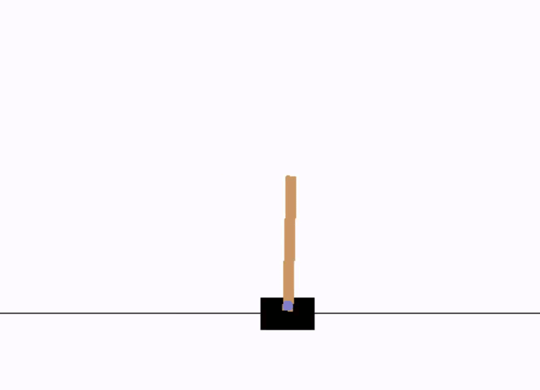
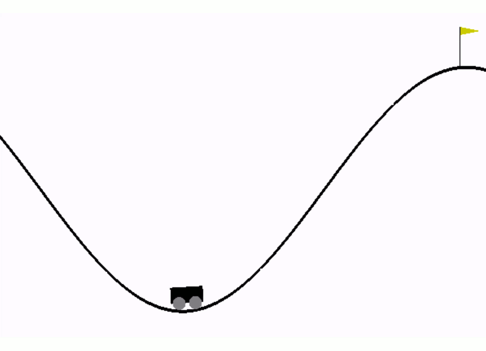

# Solving Gym environments with reinforcement learning
This project uses Python, Tensorflow and Tensorboard to solve Gym environments with double q-learning.\
The environment can be chosen by running *train.py* or *test.py* with command-line parameter 1 for Cartpole or 2 for Mountaincar.\
With *<a href="code/train.py">train.py</a>* the Gym environment can be solved using e-greedy or boltzmann exploration.\
The learned model can then be tested using *<a href="code/test.py">test.py</a>*.

## Cartpole and Mountaincar results

	
	

